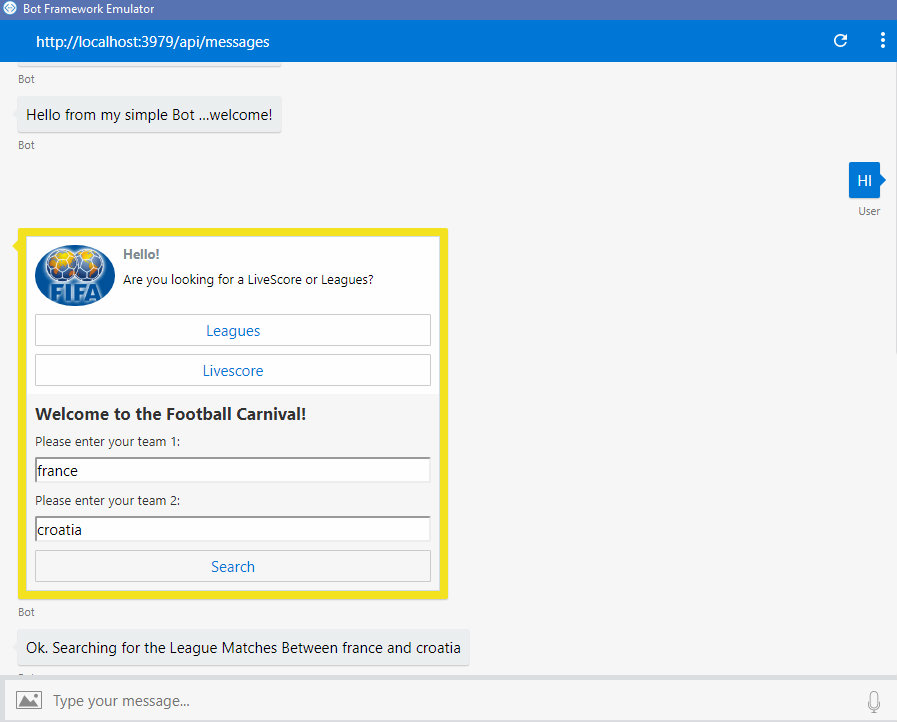
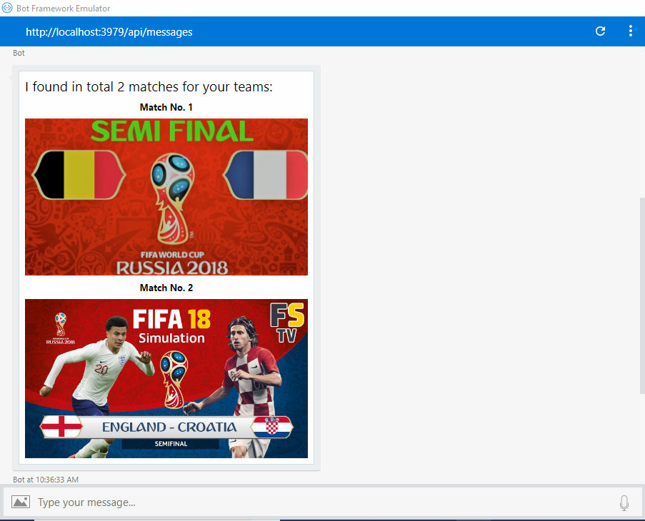

FootballBot Using BOT Framework:

This Chatbot helps you to find the league matches and livescore between two teams.
User is asked two select their choices between Leagues or Livescore and asked to enter the two team names.Result is shown as adaptive cards which is implemented using BOT framework.

It refers following :

API :https://apifootball.com

BOT framework:https://dev.botframework.com/

Microsoft Visual Studio 2017:https://visualstudio.microsoft.com

LUIS AI engine:https://www.luis.ai/

Output :

